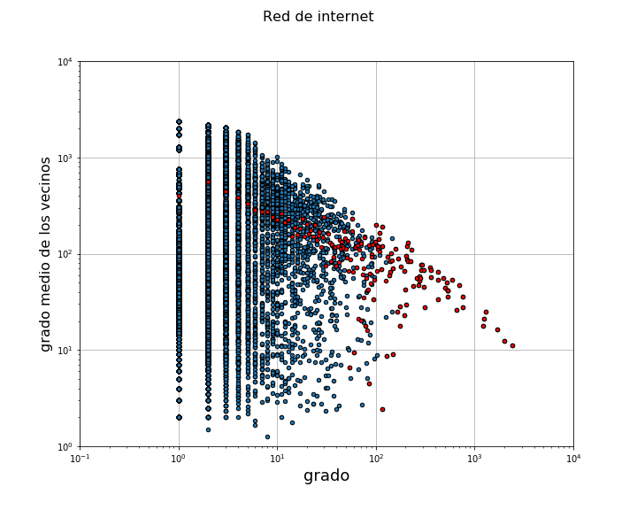
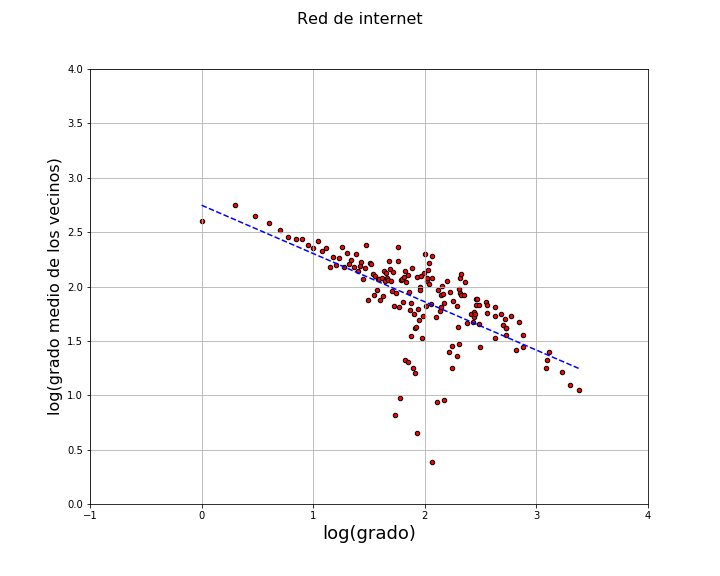

# Complex network analysis using Graph Theory

## Abstract
Several networks were analyzed using Complex Networks theory: a protein-protein interaction network, a scientific collaboration network, and a network of Internet autonomous systems. This relatively recent field was pioneered by [László Barabási](https://barabasilab.com/) and [Mark Newman](http://www-personal.umich.edu/~mejn/) among others. Many of the tools developed in this field are implemented in Python's [``NetworkX``](https://networkx.github.io/documentation/stable/index.html) library (in this project version 2 was used).

## 1. Protein-protein interaction network

We study 3 protein interaction networks, belonging to *Saccharomyces cerevisiae*, a species of yeast. These 3 networks differ in the method by which they were constructed:

#### Binary interactions network (Y2H)

The network of binary interactions reports protein-protein contacts revealed by a molecular biology method called *yeast two hybrid* (Y2H). To determine if two proteins interact with each other, each one is fused to a different fragment of a transcription factor responsible for activating a reporter gene. In the event that the proteins interact, the fragmented transcription factor is reconstituted, allowing its binding to the UAS regulatory sequence in the DNA and activation of the reporter gene.

#### Protein complex co-membership network (AP-MS)

These networks are constructed using specific antibodies to immunoprecipitate a given protein. Then, mass spectrometry (MS) identifies all the proteins that may have co-immunoprecipitated with the previous one because they are part of a multiprotein complex.

#### Network surveyed from the literature (LIT)

These are interactions reported in the literature.

### 1.1 Network visualization

First we plot each network as a graph, where nodes represent proteins and edges represent interactions. For the sake of clarity, only the largest connected component was plotted, as seen below:

### 1.2 Network features

We calculate the following features for each network:

- Number of nodes *N*
- Number of edges *L*
- Mean, max and min degree *k_mean*, *k_max*, *k_min*
- Density
- Global clustering coefficient *C_global*
- Local clustering coefficient *C_local*
- Network diameter

| FILE     | N        | L        | k_mean   | k_max    | k_min    | density  | C_global | C_local  | diameter |
| ---------|----------|----------|----------|----------|----------|----------|----------|----------|--------- |
| Y2H      | 2018     | 2930     | 2.9      | 91       | 1        | 0.001    | 0.02     | 0.05     | 14       |
| LIT      | 1536     | 2925     | 3.8      | 40       | 1        | 0.002    | 0.35     | 0.29     | 19       |
| AP-MS    | 1622     | 9070     | 11.2     | 127      | 1        | 0.007    | 0.62     | 0.55     | 15       |

### 1.3 Results and discussion

#### Number of nodes *N*

Because the Y2H method is carried out using high-throughput strategies that allow the combinatorial and automated survey of a large number of proteins simultaneously, it is to be expected that the total number of nodes will be greater for the Y2H network than for the others.

In the case of the AP-MS network, the number of nodes will depend on the available repertoire of good quality antibodies (high affinity and specificity), and therefore it is expected to contain fewer nodes (proteins) than Y2H.

The number of interactions reported on the literature, on the other hand, is expected to be limited. This is consistent with the observation that the LIT network exhibits fewer nodes than the other two.

#### Number of edges *L*

In the AP-MS network, any protein co-immunoprecipitated in a multiprotein complex is assigned links to the protein recognized by the antibody, reporting contacts that probably do not exist in nature. This would artificially increase the number of total links in the network, as observed in the results where the AP-MS links triple those of Y2H and LIT.

#### *k_mean*, *k_max*, *k_min* and density

As mentioned above, the AP-MS network artificially increases the number of neighbors for all proteins that are part of multiprotein complexes, and therefore the mean degree, maximum degree, and density of this network are expected to be higher than those of the other two.

#### Global clustering coefficient *C_global*

Global clustering is the total number of closed triplets over the total number of connected triplets. This coefficient gives greater weight to the extent to which the neighbors of high-degree nodes are connected, and therefore the AP-MS network should report a higher value than the other two networks, even higher than its value of \ <C\>. The results obtained agree with what was expected, given that the value of the global clustering coefficient of AP-MS is 26 times greater than that of Y2H and approximately two times greater than that of the network of co-membership of protein complexes.

#### Local clustering coefficient *C_local*

\<C\> increases with the number of linked neighbors of a network. In the AP-MS network, if each protein is assigned links to all the others immunoprecipitated in the same multiprotein complex, the \<C\> coefficient is artificially increased by estimating contacts that probably do not exist in nature. The results obtained in this problem are as expected since the AP-MS network has the highest value of \<C\>, 12 times higher than that of the Y2H binary network. The literature network has an intermediate \<C\>, with a value 6 times greater than that of Y2H. This last observation could be due to the possible occurrence of false negatives in the Y2H method, that is, a high number of protein-protein interactions would be undetectable by Y2H but could be detected by various other techniques reported in the literature.

## 2. Degree assortativity analysis

In this section we analyze two different networks curated by Mark Newman, and available in his [personal page](http://www-personal.umich.edu/~mejn/netdata/):

- Internet autonomous systems network.
- Network of co-authoring of scientific articles (specifically on the topic of complex networks)

Our goal is to determine if high degree nodes tend to connect with other high degree nodes, or if on the contrary they tend to connect to low degree nodes. That is, if the network is assortative or dissortative with respect to degree. In order to do this:

1. We calculate, for nodes of degree *𝑘*, the mean value of the degrees of its neighbors *knm(k)*.
2. We analyze this trend in a plot that records said value as a function of the degree.
3. Assuming that *knm(k) = ak&mu;*, the correlation coefficient is estimated by performing a regression of *log(k)nn< /sub> ~ log(k)*. On logarithmic scale *µ* is the slope of the line, and provides a measure of assortativity.
4. We calculate the assortativity of the network now with the Newman estimator, detailed in equations 8.26 - 8.29 of his book *Networks, an introduction*

### 2.1 Results and discussion

#### Autonomous systems network

 

In the two upper figures, each blue point is a node. the *𝑥* coordinate represents the node's degree, and the 𝑦 coordinate represents the average of the degrees of all its neighbors. The average of the mean degree of the neighbors for each degree is shown in red (*𝑘nm*). In other words, the average of all *𝑦* coordinates realized for each *𝑥* coordinate.

The slope of the fit is -0.44, while the Newman estimator is -0.20. Both are consistent in indicating dissortativity, given the negative sign. In other words, in this network, high degree nodes tend to be related to low degree nodes.

#### Scientific collaborations network

 

In this case, the slope of the fit is 0.31 while Newman's estimator is 0.46, so we conclude that this network is assortative with respect to degree.

### 3. Conclusions

We analyzed several networks using the theory of complex networks, which is a subset of graph theory. We were able to extract features that characterize the networks, as well as determine wether certain networks are assortative or dissortative with respect to degree.