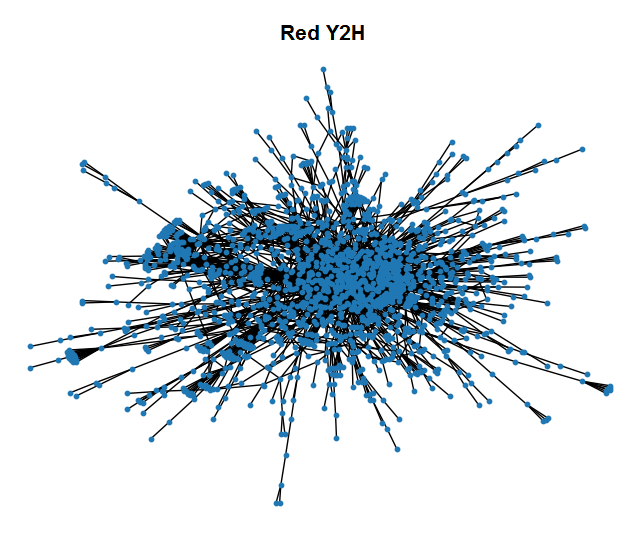
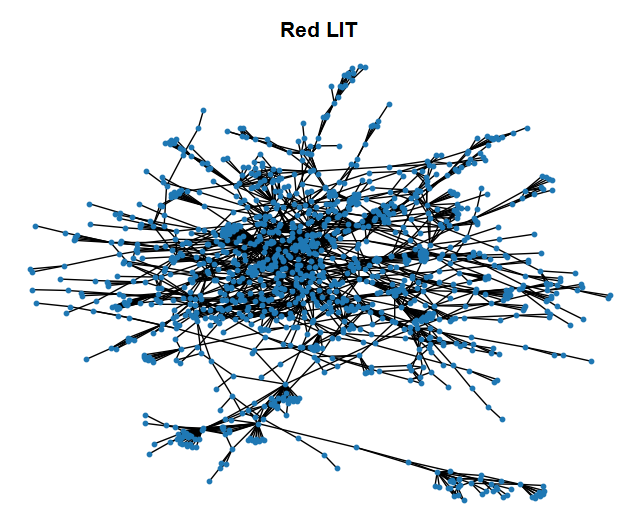
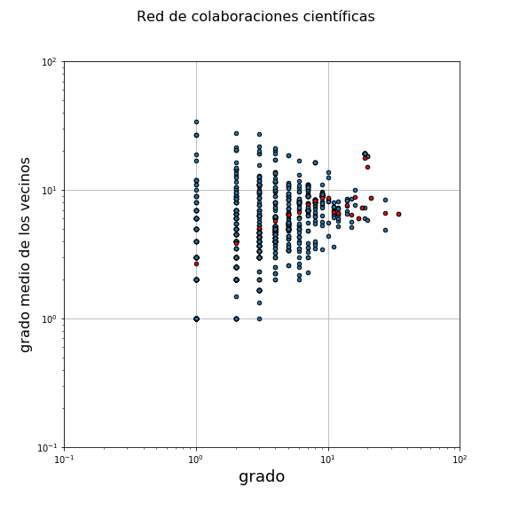

# Redes Complejas

En este trabajo se analizan distintas redes (redes de interacción proteína-proteína, redes sociales, redes de colaboraciones científicas) utilizando herramientas de Redes Complejas. Ésta es un área de investigación relativamente joven (años 2000) de la que fueron pioneros László Barabási y Mark Newman entre otros. Estas herramientas están implementadas en la librería  [``NetworkX``](https://networkx.github.io/documentation/stable/index.html) (versión 2).

## Parte 1
En esta sección se estudian 3 redes de interacciones entre proteínas, las cuales están en la carpeta ``dataset``. Estas 3 redes corresponden a un mismo organismo (levadura) pero fueron relevadas de distintas maneras (esto se explica en detalle en la sección *Análisis de los resultados*):

* ``yeast_Y2H.txt``: red de interacciones binarias
* ``yeast_AP-MS.txt``: red de copertenencia a complejos proteicos
* ``yeast_LIT.txt``: red relevada de la literatura

En el script ``parte_1.py`` se desarrolla el siguiente análisis:
En primer lugar se grafica cada red representándola con un grafo, donde cada nodo es una proteína y cada vértice representa una interacción. Para mayor claridad sólo se graficó la componente conexa más grande, como se muestra a continuación:

En segundo lugar se calculan diversas propiedades de las redes (ver sección *Análisis de los resultados*), y se muestran los resultados en la siguiente tabla:

| FILE     | N        | L        | k_medio  | k_max    | k_min    | densidad | C_global | C_local  | diametro |
| ---------|----------|----------|----------|----------|----------|----------|----------|----------|--------- |
| Y2H      | 2018     | 2930     | 2.9      | 91       | 1        | 0.001    | 0.02     | 0.05     | 14       |
| LIT      | 1536     | 2925     | 3.8      | 40       | 1        | 0.002    | 0.35     | 0.29     | 19       |
| AP-MS    | 1622     | 9070     | 11.2     | 127      | 1        | 0.007    | 0.62     | 0.55     | 15       |

### Análisis de los resultados:

**Número de nodos (N)**\
La red de interacciones binarias reporta contactos proteína-proteína relevados por un método de biología molecular denominado doble híbrido de levaduras (*yeast two hybrid: Y2H*). Para determinar si dos proteínas interactúan entre sí, cada una se fusiona a un fragmento distinto de un factor de transcripción encargado de activar a un gen reportero. En el caso de que las proteínas interactúen, el factor de transcripción fragmentado se reconstituye, permitiendo su unión a la secuencia regulatoria UAS en el ADN y la activación del gen reportero. El método Y2H se lleva a cabo mediante estrategias *high-throughput* (de alto rendimiento) que permiten relevar en forma combinatoria y automatizada un alto número de proteínas en simultáneo. Las proteínas constituyen los nodos de las redes analizadas, y por lo tanto es esperable que el número total de nodos de Y2H (2018) sea mayor al de las otras dos.\
Las redes de co-pertenencia a complejos protéicos (AP-MS) se construyen utilizando anticuerpos específicos para inmunoprecipitar una proteína dada, y luego se identifican por espectrometría de masa (MS) todas las proteínas que puedan haber co-inmunoprecipitado con la anterior por formar parte de un complejo multiproteico. En este caso la cantidad de nodos de la red dependerá del repertorio disponible de anticuerpos de buena calidad (alta afinidad y especificidad), y por lo tanto se espera que contenga un número de nodos (proteínas) menor que el de Y2H. La red obtenida de la literatura reporta interacciones determinadas por distintos métodos, pero también se espera que no logre cubrir todas las combinaciones posibles analizadas en un método *high-throughput*.

**Número de enlaces (L)**\
En la red AP-MS, a toda proteína co-inmunoprecipitada en un complejo multiproteico se le asignan enlaces con la proteína reconocida por el anticuerpo, reportando contactos que probablemente no existen en la naturaleza. Esto aumentaría artificialmente el número de enlaces totales de la red, tal como se observa en los resultados donde los enlaces de AP-MS triplican a los de Y2H y de la literatura.

**Grado medio (k_medio), grado máximo (k_max) y densidad**\
Como se mencionó arriba, la red AP-MS aumenta artificialmente el número de vecinos para todas las proteínas que formen parte de complejos multiproteicos, y por lo tanto se espera que el grado medio, grado máximo y densidad de esta red sean superiores a los de las otras dos.

**Coeficiente de clustering global**\
El clustering global es el número total de tripletes cerrados sobre el número total de tripletes conectados. Este coeficiente da mayor peso a la medida en la que se conectan los vecinos de los nodos de alto grado, y por lo tanto la red AP-MS debería reportar un valor superior al de las otras dos redes, incluso mayor que su valor de \<C\>. Los resultados obtenidos concuerdan con lo esperado, dado que el valor del coeficiente de clustering global de AP-MS es 26 veces mayor que el de Y2H y aproximadamente dos veces mayor que el de la red de co-pertenencia a complejos protéicos.

**Coeficiente de clustering local (\<C\>)**\
\<C\> aumenta con el número de vecinos enlazados de una red. En la red AP-MS, si a cada proteína se le asignan enlaces con todas las demás inmunoprecipitadas en el mismo complejo multiproteico, el coeficiente \<C\> se ve incrementado artificialmente por la estimación de contactos probablemente inexistentes en la naturaleza. Los resultados obtenidos en este problema son los esperados dado que la red AP-MS posee el mayor valor de \<C\>, 12 veces superior al de la red binaria Y2H. La red de la literatura posee un \<C\> intermedio, con un valor 6 veces mayor al de Y2H. Esta última observación podría deberse a la posible ocurrencia de falsos negativos en el método Y2H, es decir, un alto número de interacciones proteína-proteína serían indetectables por Y2H pero podrían ser detectadas por varias otras técnicas reportadas en la literatura.

## Parte 2

En el script ``parte_2.py`` se analizan dos redes relevadas por Mark Newman, las cuales están disponibles en su [página personal](http://www-personal.umich.edu/~mejn/netdata/).
* ``as-22july06.gml``: red de sistemas autónomos de internet.
* ``netscience.gml``: red de coautoría de artículos científicos, específicamente sobre el tema de redes complejas.

El primer objetivo es determinar si los nodos de alto grado tienden a conectarse con otros nodos de alto grado, o si por el contrario suelen conectarse a nodos de bajo grado. Es decir, si la red es asortativa o disortativa respecto al grado. Para ello:
1. Se calcula, para nodos de grado *𝑘*, cuánto vale en media el grado de sus vecinos *knm(k)*.
2. Se analiza la tendencia observada en un gráfico que consigne dicho valor como función del grado.
3. Asumiendo que *knm(k) = ak&mu;*, se estima el coeficiente de correlación realizando una regresión de *log(k)nn ~ log(k)*. En escala logarítmica *&mu;* es la pendiente de la recta, y proporciona una medida de la asortatividad.
4. Calculando la asortatividad de la red ahora con el estimador de Newman, detallado en las ecuaciones 8.26 - 8.29 de su libro *Networks, an introduction*

### Resultados y análisis
#### Red de sistemas autónomos
 

En las dos figuras superiores se observa lo siguiente: cada punto azul es un nodo. En la coordenada *𝑥* está su grado, y en la coordenada 𝑦 el promedio de los grados de todos sus vecinos. En rojo se muestra el promedio del grado medio de los vecinos para cada grado (*𝑘nm*). En otras palabras: el promedio de todas las coordenadas *𝑦* realizadas para cada coordenada *𝑥*

En esta red se observa una tendencia a que nodos de alto grado se relacionen más con otros nodos de bajo grado, es decir que presenta un comportamiento disortativo.

#### Red de colaboraciones científicas
 

EEn esta otra red en cambio se observa un comportamiento asortativo.
